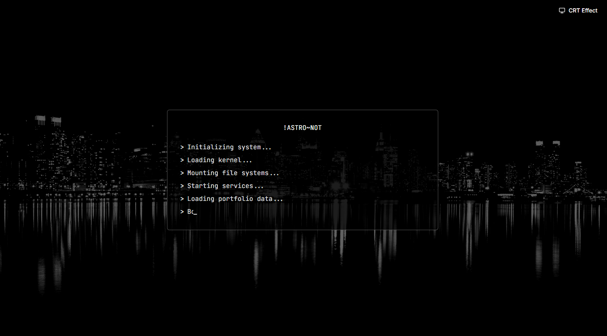
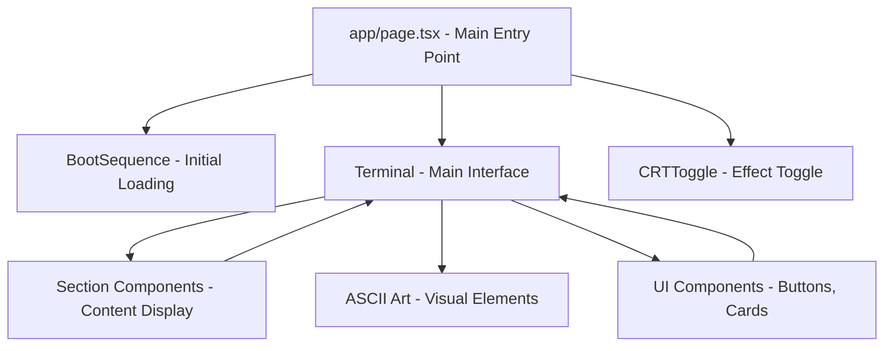
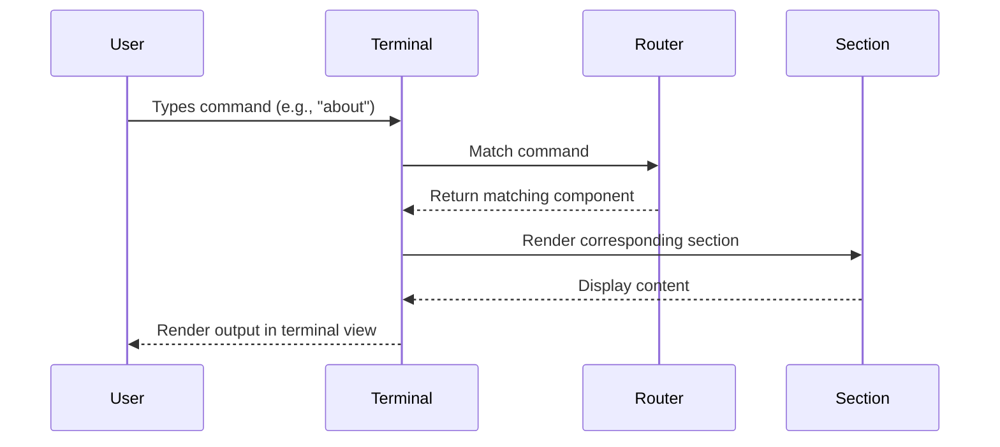

# Portfolio Website


A retro-inspired, terminal-based portfolio website with ASCII art and a Linux terminal interface. This interactive portfolio simulates a command-line experience while showcasing professional information in a unique and engaging way.
<p align="center">
  
</p>
---

## ✨ Features

<table>
  <thead>
    <tr>
      <th>Feature</th>
      <th>Description</th>
    </tr>
  </thead>
  <tbody>
    <tr>
      <td>🖥️ Terminal Interface</td>
      <td>Fully interactive command-line experience with command history</td>
    </tr>
    <tr>
      <td>🎨 ASCII Art</td>
      <td>Custom ASCII art for section headers and portrait</td>
    </tr>
    <tr>
      <td>📱 Responsive Design</td>
      <td>Fully responsive layout that works on mobile, tablet, and desktop</td>
    </tr>
    <tr>
      <td>🌙 Dark Mode</td>
      <td>Terminal-inspired dark theme for optimal viewing</td>
    </tr>
    <tr>
      <td>📺 CRT Effect</td>
      <td>Toggle CRT screen effect for retro aesthetics</td>
    </tr>
    <tr>
      <td>⌨️ Command Navigation</td>
      <td>Navigate through sections using terminal commands</td>
    </tr>
    <tr>
      <td>🔄 Boot Sequence</td>
      <td>Simulated boot sequence animation on initial load</td>
    </tr>
    <tr>
      <td>📊 Skills Visualization</td>
      <td>Visual representation of skills with progress bars</td>
    </tr>
    <tr>
      <td>📝 Project Diagrams</td>
      <td>ASCII diagrams showing project architecture</td>
    </tr>
  </tbody>
</table>

---

## 🛠️ Technologies Used

<table>
  <thead>
    <tr>
      <th>Category</th>
      <th>Technologies</th>
    </tr>
  </thead>
  <tbody>
    <tr>
      <td><strong>Frontend Framework</strong></td>
      <td>Next.js 14, React 18</td>
    </tr>
    <tr>
      <td><strong>Styling</strong></td>
      <td>Tailwind CSS, CSS Modules</td>
    </tr>
    <tr>
      <td><strong>UI Components</strong></td>
      <td>shadcn/ui, Radix UI</td>
    </tr>
    <tr>
      <td><strong>Icons</strong></td>
      <td>Lucide React</td>
    </tr>
    <tr>
      <td><strong>Typography</strong></td>
      <td>JetBrains Mono, Inter</td>
    </tr>
    <tr>
      <td><strong>State Management</strong></td>
      <td>React Hooks</td>
    </tr>
    <tr>
      <td><strong>Deployment</strong></td>
      <td>Vercel</td>
    </tr>
    <tr>
      <td><strong>Development Tools</strong></td>
      <td>TypeScript, ESLint</td>
    </tr>
  </tbody>
</table>

---

## 🏗️ Project Architecture




---

## 🧭 Sequence Diagram



---

## 📥 Installation

```bash
# Clone the repository
git clone https://github.com/yourusername/ascii-portfolio.git

# Navigate to the project directory
cd ascii-portfolio

# Install dependencies
npm install

# Start the development server
npm run dev
```

### Prerequisites

- Node.js 18.x or higher
- npm or yarn

---

## 🚀 Usage

Visit `http://localhost:3000` in your browser after starting the dev server.

### Available Terminal Commands

```
help          - Show available commands
about         - View personal information
education     - View educational background
skills        - View technical skills
experience    - View work experience
projects      - View projects
certifications- View certifications and achievements
contact       - View contact information
clear         - Clear the terminal
ls            - List available sections
whoami        - Display user information
date          - Display current date and time
```

You can also use the navigation buttons below the terminal.

---

## 🛠️ Customization

1. Edit personal content under `components/sections/`
2. Replace ASCII art in `components/ascii-art-component.tsx`
3. Change prompt style in `components/terminal.tsx`
4. Update project links in `components/sections/projects-section.tsx`

---

## 👥 Contributing

Contributions are welcome!

```bash
# Fork the repository
# Create a feature branch
git checkout -b feature/amazing-feature

# Make your changes and commit
git commit -m "Add some amazing feature"

# Push to your fork
git push origin feature/amazing-feature

# Open a Pull Request
```

### Guidelines

- Match existing code style
- Use clear commit messages
- Update documentation
- Comment complex logic
- Maintain responsiveness
- Test across devices

---

## 📄 License

This project is licensed under the [MIT License](LICENSE).

---
